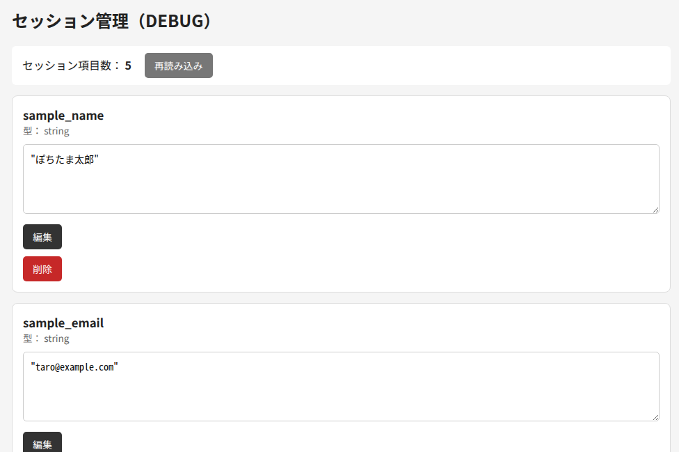
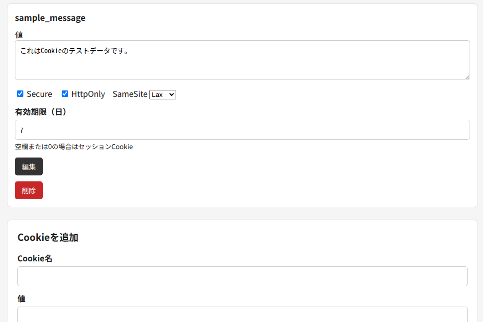

# PHP Session & Cookie Inspector

PHPの開発時にSessionとCookieの内容を確認・編集するための
開発者向けツールです。

## Features

- Sessionの確認
- Session値の編集
- Session変数の削除
- Cookieの確認
- Cookie値の編集
- Cookieの削除

## Warning

このツールは開発環境専用です。

認証なしでアクセスできる環境に設置すると、
SessionやCookieを第三者に操作される可能性があります。

本番環境には設置しないでください。

## Screenshots

### Session

### Cookie

